# Projeto RA2 Funcional: Sistema de Inventário Haskell

Disciplina: Programação Lógica e Funcional

Professor: Frank Coelho de Alcantara

Alunos: 

- Cecília Lucchesi Mardegan (usuário: [ceciLcchM](https://github.com/ceciLcchM))
- Christine von Schmalz (usuário: [cvschmalz](https://github.com/cvschmalz))
- Erick Maestri de Souza (usuário: [ErickMS18](https://github.com/ErickMS18))

## Descrição do Projeto

Este projeto implementa um sistema de inventário em Haskell, que permite:

- Adicionar itens  
- Remover itens  
- Atualizar quantidade de itens
- Vender itens (reduzir o estoque)  
- Listar inventário  
- Registrar todas as operações automaticamente
- Visualizar relatórios (erros, item mais movimentado, e histórico por ID)

O sistema utiliza arquivos externos para persistência de dados: o inventário é gravado em `Inventario.dat` e a auditoria é gravada em `Auditoria.log`.

### CRUD

Conforme a especificação, foram criadas as funções de CRUD `addItem`, `removeItem` e `updateQty`. 

Interpretamos que `addItem` e `removeItem` seriam para criar e remover estruturas inteiras de itens do inventário, e portanto criamos também uma função `venderItem` para apenas reduzir a quantidade ou estoque de um item, conforme as exigências do projeto.

### Logs e relatórios

Implementamos as funções `logsDeErro`, `historicoPorItem` e `itemMaisMovimentado` conforme exigido, assim como algumas funções auxiliares `criarLog`, `imprimirLogEntry` e `imprimirAcao` para deixar o código mais limpo.

### Main

O código principal do programa automaticamente popula o inventário com 15 itens ao iniciar, caso ainda não exista um inventário. Caso contrário, ele carrega o inventário do arquivo `Inventario.dat` normalmente.

O loop principal permite ao usuário interagir com o inventário, podendo adicionar itens, remover itens, atualizar suas quantidades, realizar uma venda (o que reduz o estoque), listar o inventário e visualizar um relatório.

## Como Executar o Projeto

Este programa foi feito no Online GDB, conforme exigido na especificação.

### Link:
  https://onlinegdb.com/itrc0aUZo

### Executando no Online GDB
1. Acesse o link acima
2. Abra o arquivo principal (`main.hs`) no editor
3. Clique em "Run"
4. O programa iniciará exibindo o menu principal.

# Cenários de testes manuais

Seguem abaixo os testes feitos conforme a especificação.

## Cenário 1: Persistência de Estado (Sucesso)

### Passo 1: Iniciar o programa (sem arquivos de dados).
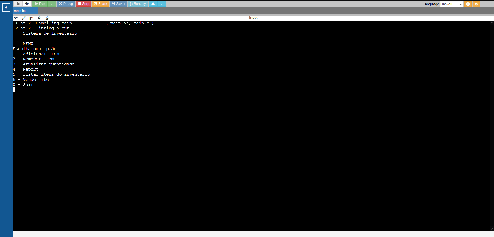

Na barra no topo da tela, pode-se ver que só existe o arquivo `main.hs`.

### Passo 2: Adicionar 3 itens.
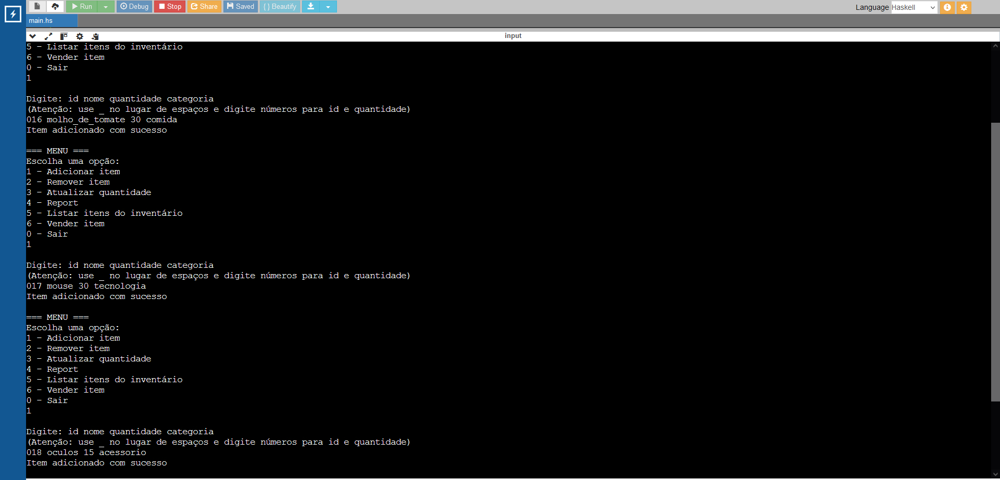

Adicionamos os itens `molho_de_tomate`, `mouse`, e `oculos`.

### Passo 3: Fechar o programa.
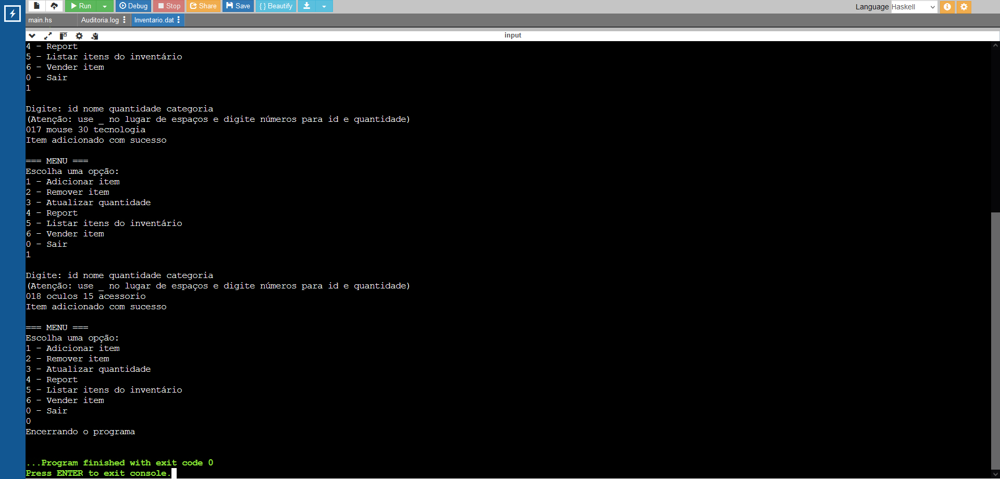

Os arquivos `Inventario.dat` e `Auditoria.log` aparecem ao lado do `main.hs`.

### Passo 4: Verificar se os arquivos Inventario.dat e Auditoria.log foram criados.
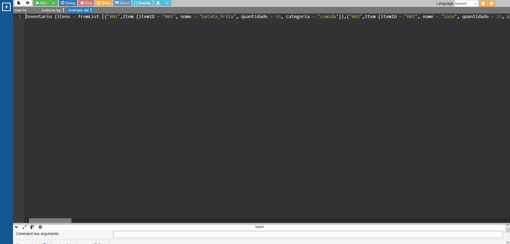
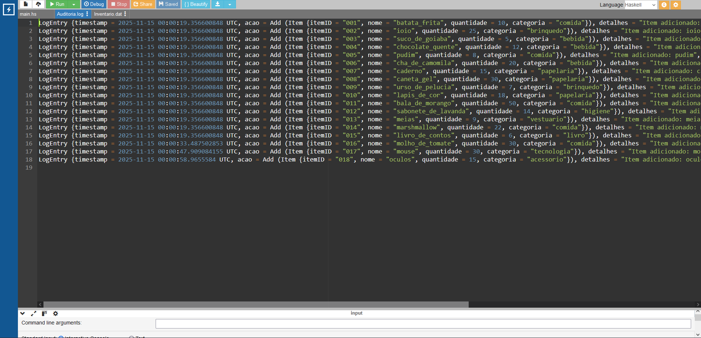

Os arquivos contém os dados iniciais do inventário gerados automaticamente, assim como os 3 itens adicionados pelo usuário.

### Passo 5: Reiniciar o programa.
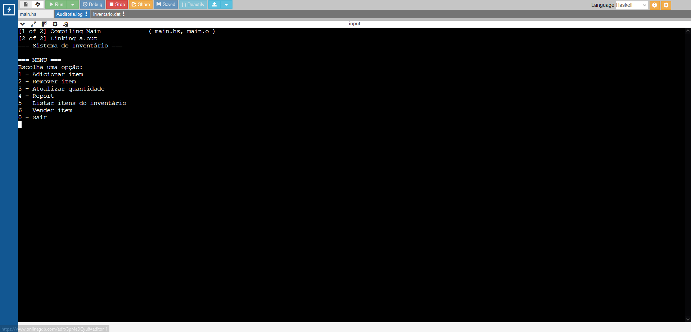

### Passo 6: Executar um comando de "listar" (a ser criado) ou verificar se o estado carregado em memória contém os 3 itens.
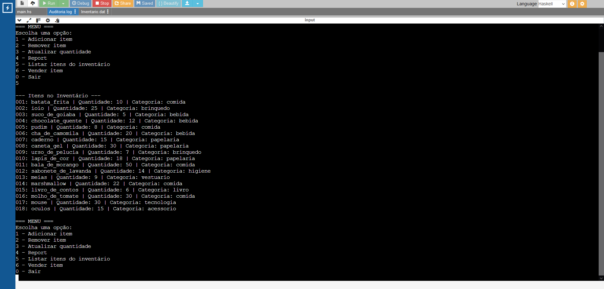

Todos os novos itens aparecem na lista.

## Cenário 2: Erro de Lógica (Estoque Insuficiente)

### Passo 1: Adicionar um item com 10 unidades (ex: "teclado").

### Passo 2: Tentar remover 15 unidades desse item. Verificar se o programa exibiu uma mensagem de erro clara.
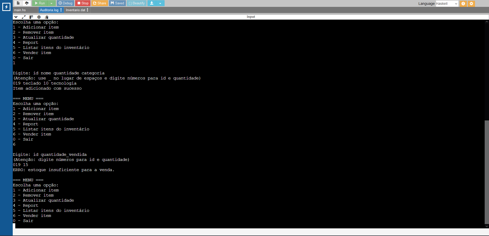

Ao tentar vender 15 unidades, aparece a mensagem "ERRO: estoque insuficiente para venda."

### Passo 3: Verificar se o Inventario.dat (e o estado em memória) ainda mostra 10 unidades.
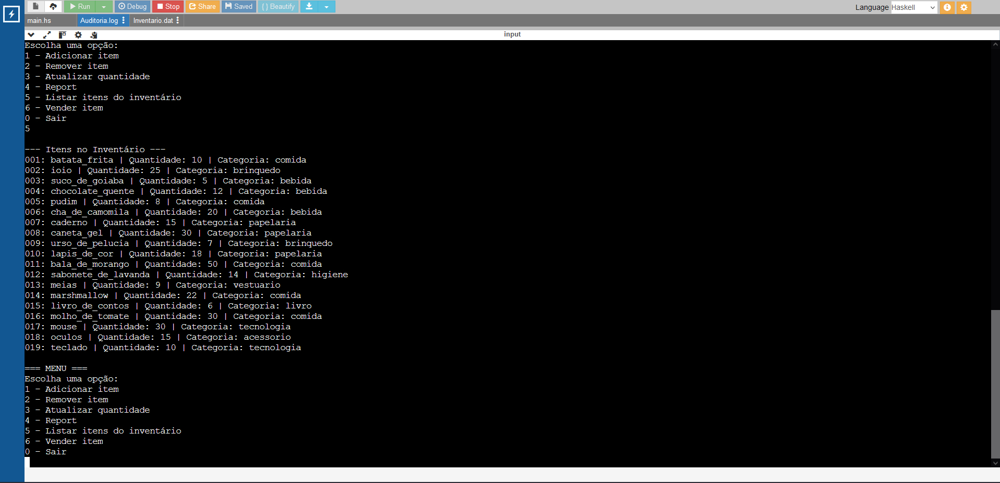

O estado em memória mostra 10 unidades.

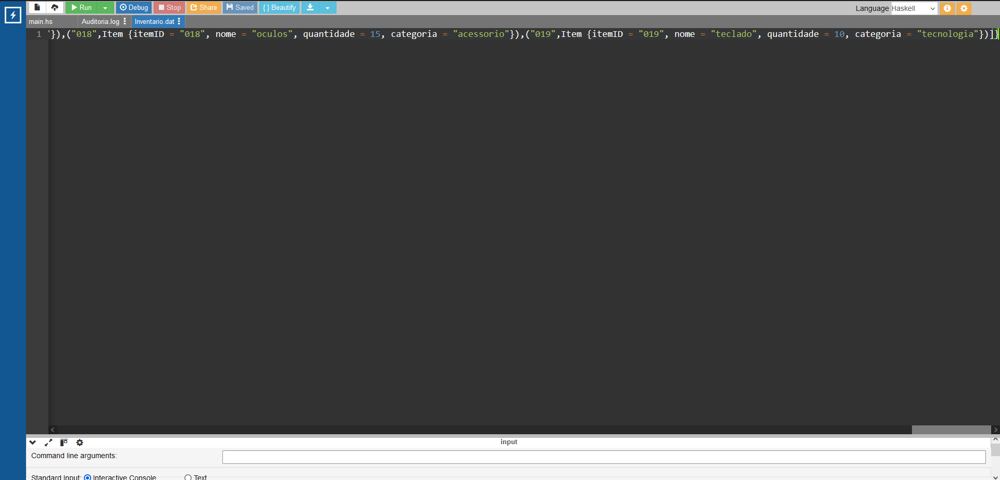

O último item "teclado" continua tendo uma quantidade igual a 10.

### Passo 4: Verificar se o Auditoria.log contém uma LogEntry com StatusLog (Falha ...).
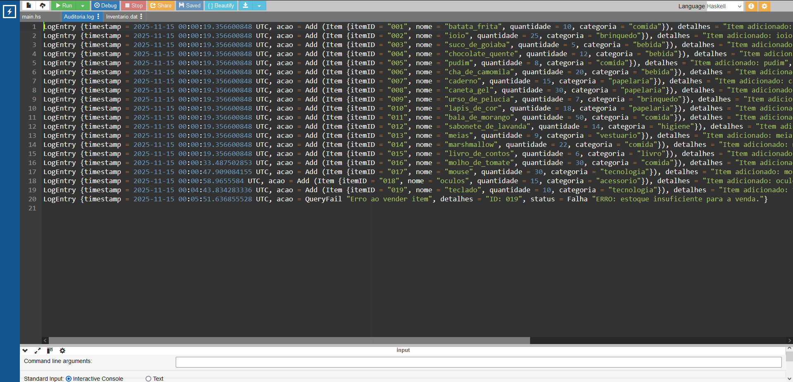

A última linha mostra o erro com status igual a "Falha".

## Cenário 3: Geração de Relatório de Erros

### Após executar o Cenário 2, executar o comando report. Verificar se o relatório gerado (especificamente pela função logsDeErro) exibe a entrada de log referente à falha registrada no Cenário 2 (a tentativa de remover estoque insuficiente).
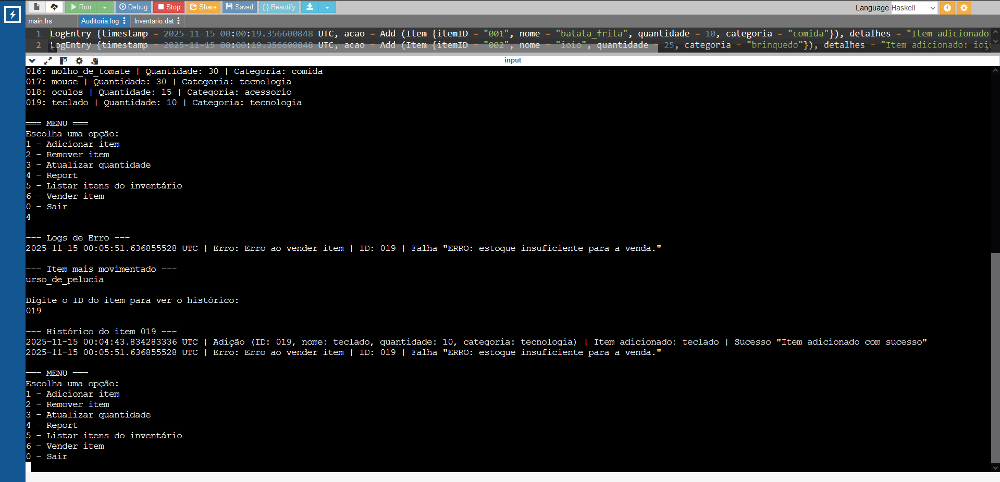

O erro aparece tanto na seção de logs de erro quanto na seção do histórico do item.

